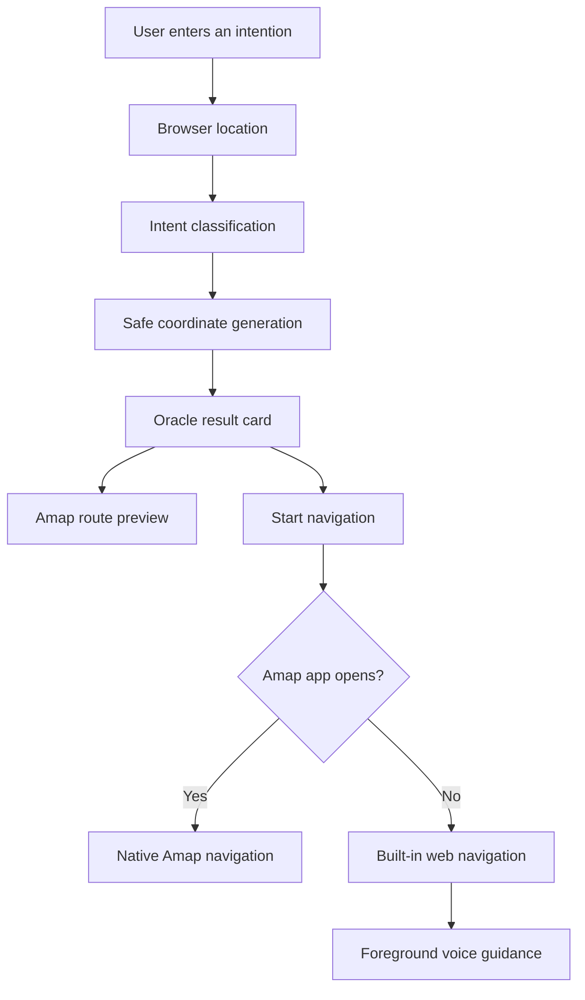
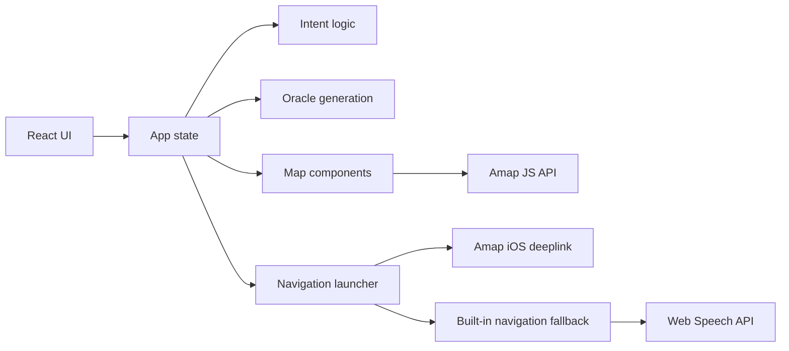

# LingYan MVP

**LingYan is a mobile-first AI oracle for intent, place, and lightweight navigation.**

It turns a short human intention into a safe, reachable city coordinate, then guides the user there with a map, route context, and front-stage voice prompts. On iPhone, LingYan is designed to run as a PWA: open it in Safari, add it to the Home Screen, and use it like a lightweight app without App Store distribution.

## Why It Exists

Most navigation apps start with a destination. LingYan starts with a thought.

```text
"I need inspiration."
"I want a quiet place."
"Take me somewhere that fits this moment."
```

LingYan interprets the intent, picks a public and approachable location nearby, creates a short "micro-action" prompt, and offers a navigation path. If Amap is available, LingYan can hand off to native navigation. If not, it keeps a built-in web navigation fallback.

## Core Experience



## Features

| Area | Status | Notes |
|---|---:|---|
| Intent input | ✅ | Short intention-based interaction |
| Location access | ✅ | Browser geolocation with demo fallback |
| Coordinate generation | ✅ | Deterministic safe-public-location style MVP |
| Map display | ✅ | Leaflet fallback and Amap route view |
| Amap route planning | ✅ | Walking, driving, and transit route modes |
| Native Amap handoff | ✅ | iOS deeplink attempt with web fallback |
| Voice prompts | ✅ | Foreground Web Speech API guidance |
| PWA install support | ✅ | Manifest, icon, iOS meta tags, service worker |
| Background navigation | ❌ | Not promised in PWA mode |
| App Store distribution | ❌ | Intentionally not required for MVP |

## Architecture



## Tech Stack

| Layer | Choice |
|---|---|
| Language | TypeScript |
| UI | React 18 |
| Build | Vite |
| Map fallback | Leaflet |
| Route provider | Amap JS API |
| PWA | Web App Manifest + Service Worker |

## Local Development

```bash
npm install
npm run dev
```

Build production assets:

```bash
npm run build
```

Preview the production build:

```bash
npm run preview
```

## Amap Configuration

Create `.env.local` from `.env.example`:

```bash
cp .env.example .env.local
```

Then configure:

```env
VITE_AMAP_JS_KEY=
VITE_AMAP_SECURITY_JSCODE=
```

Without an Amap key, LingYan still runs with its built-in map fallback, but Amap route planning is disabled.

## iPhone PWA Usage

1. Open the deployed LingYan URL in Safari.
2. Tap the Share button.
3. Choose **Add to Home Screen**.
4. Launch LingYan from the Home Screen.

For best navigation fallback behavior, keep LingYan in the foreground. Native Amap navigation should be preferred for background/lock-screen navigation.

## Product Boundaries

LingYan is an MVP. It does not replace professional navigation apps.

| Boundary | Reason |
|---|---|
| No guaranteed background GPS | iOS PWA background execution is limited |
| No lock-screen voice navigation promise | Native apps are better suited for that |
| No safety-critical routing promise | Users must follow real-world traffic and safety conditions |
| No private-area guidance | Generated points should remain public and approachable |

## Roadmap

| Priority | Item |
|---:|---|
| P0 | Stabilize iPhone PWA deployment |
| P0 | Test Amap app handoff on real iPhone Safari |
| P1 | Add clearer Add-to-Home-Screen onboarding |
| P1 | Improve route-step voice prompts |
| P1 | Add location candidate confirmation |
| P2 | Add account/history support |
| P2 | Add backend AI intent resolver |

## Repository

This repository is the LingYan MVP frontend:

```text
qinheming/lingyan-mvp
```

It is currently optimized for fast iteration by an independent builder: small surface area, mobile-first UI, and no App Store dependency.
